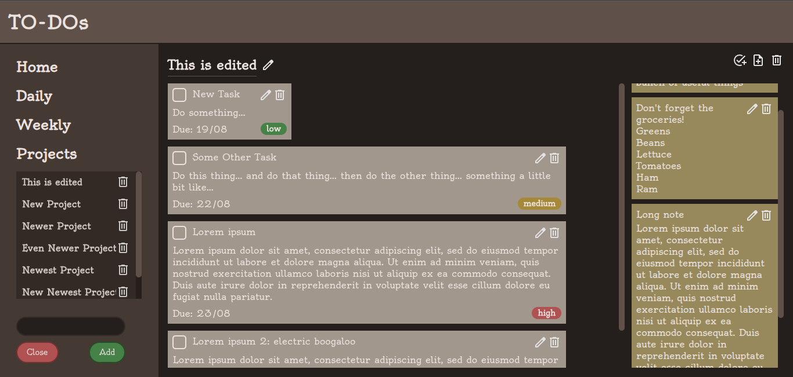

# To-Do List

A project and task manager built as part of [The Odin Project's JavaScript curriculum](https://www.theodinproject.com/lessons/node-path-javascript-todo-list), bundled with Webpack.

Projects, tasks, and notes are backed by a shared `Collection`/`Controller` layer that handles CRUD operations, cascading deletes, and persistence to `localStorage`, so the UI layer only has to render state and dispatch changes. Tasks and notes are created through reusable dialogs.